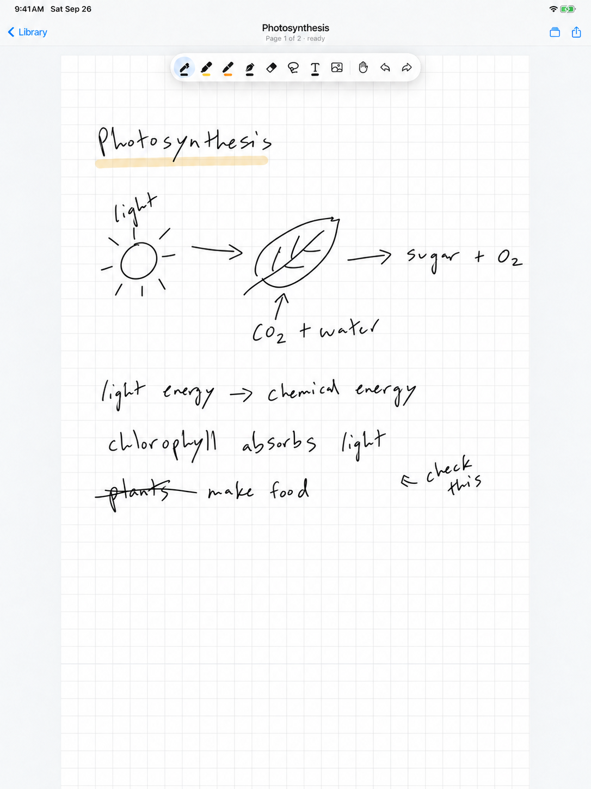
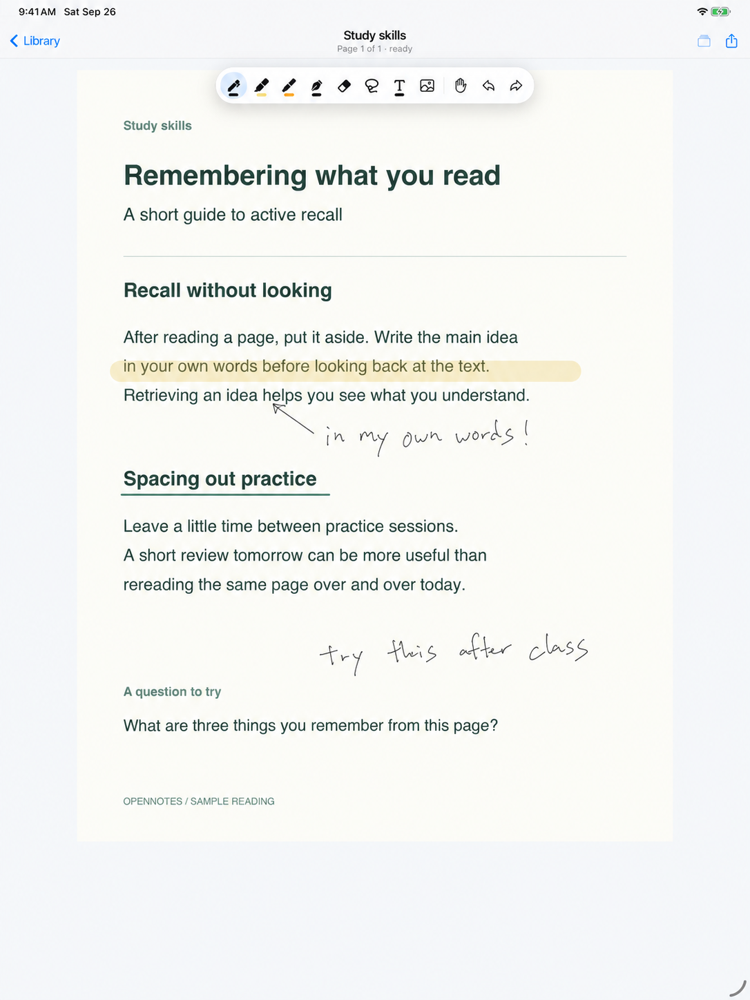

# OpenNotes

Free, open-source handwritten notes and PDF annotation for iPad and iPhone.

[Download on the App Store](https://apps.apple.com/app/id6771224004) · [Drawing engine](https://github.com/mathnotes-app/mobile-ink) · [Report a bug](https://github.com/mathnotes-app/OpenNotes/issues)

Write with Apple Pencil, mark up PDFs, and organize your notebooks into folders. No account required. The app and its native drawing engine are both open source under Apache-2.0.

<p>
  
  
</p>

Illustrative app images with AI-edited sample handwriting.

<p>
  <a href="https://github.com/mathnotes-app/OpenNotes/actions/workflows/ci.yml"></a>
  <a href="https://github.com/mathnotes-app/OpenNotes/blob/main/LICENSE"></a>
  <a href="https://github.com/mathnotes-app/mobile-ink"></a>
</p>

The iPad and iPhone app is available on the App Store. This repository also includes an Android project you can build from source.

## Features

- Apple Pencil and touch-friendly native ink powered by Mobile Ink.
- Plain, lined, grid, graph, dotted, and PDF-backed notebooks.
- Folder and note library with local thumbnails.
- PDF import from picker, share/open-in flows, and multi-page notebooks.
- Image and text objects on top of handwritten pages.
- PDF export for sharing notebooks outside the app.
- Local-first storage with no account system and no analytics.

## Building a Drawing App?

OpenNotes is a complete app built with [`@mathnotes/mobile-ink`](https://github.com/mathnotes-app/mobile-ink), the React Native ink engine extracted from MathNotes. The engine provides native drawing, selection, zoom, scrolling, and a continuous notebook canvas. OpenNotes adds the library, folders, document storage, and import/export flows.

Use this repository to explore a working integration, or start with the engine's [quickstart](https://github.com/mathnotes-app/mobile-ink#quickstart) to add handwriting to your own app.

## Development

This repo contains an Expo dev-client app with native iOS and Android projects. Expo Go is not supported because Mobile Ink includes native code.

```sh
npm ci --legacy-peer-deps
npm run typecheck
```

Run on a device or simulator:

```sh
npx expo run:ios
npx expo run:android
```

For a physical iOS device:

```sh
npx expo run:ios --device
```

## Repository Layout

- `app/` - Expo Router screens for the library, folders, and editor.
- `src/components/` - reusable library and editor UI.
- `src/services/` - local note, folder, PDF, image, and export storage.
- `ios/` and `android/` - generated native projects required by the dev-client app.

## Privacy

OpenNotes stores notes, imported PDFs, images, and thumbnails on your device. It does not require an app account or include analytics SDKs or tracking.

On iOS, iCloud backup is enabled by default when available and can be turned off in the app. It backs up notebook data to your iCloud account; it is separate from live collaboration or document sync between devices.

If you export, share, back up, or import files through another app or operating-system service, that service's behavior is outside OpenNotes.

Public legal and support pages:

- [Privacy Policy](https://mathnotes-app.github.io/OpenNotes/privacy/)
- [Terms of Use](https://mathnotes-app.github.io/OpenNotes/terms/)
- [Support](https://mathnotes-app.github.io/OpenNotes/support/)

## Contributing

Bug reports, feature requests, and focused pull requests are welcome. Start with [CONTRIBUTING.md](CONTRIBUTING.md). Useful contributions include reproducing a bug on your device, improving translations, documenting setup problems, or fixing an issue. Include your device, OS version, and steps to reproduce when reporting a bug, and please avoid attaching private notes or documents to public issues.

For ink-engine bugs or reusable canvas work, the engine repo is [`mathnotes-app/mobile-ink`](https://github.com/mathnotes-app/mobile-ink).

You can also reach Mark on X: [@markpm39](https://x.com/markpm39).

## Security

Please report security issues privately. See [SECURITY.md](SECURITY.md).

## License

Apache-2.0. Copyright BuilderPro LLC.
